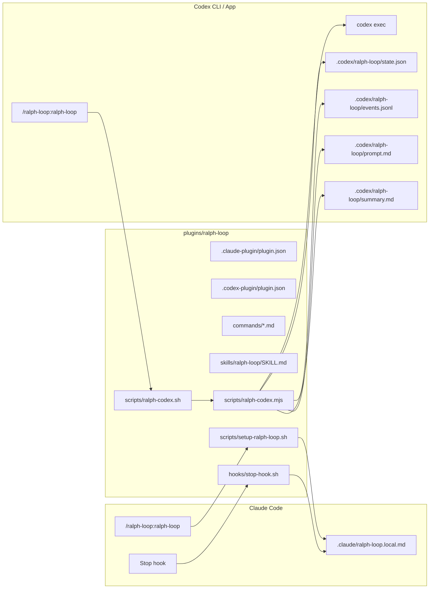
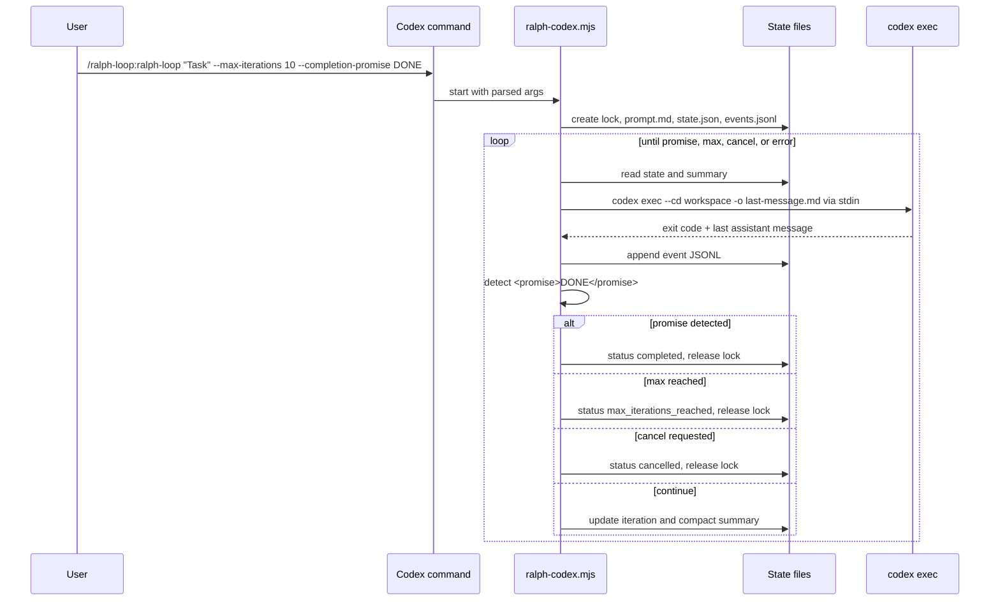
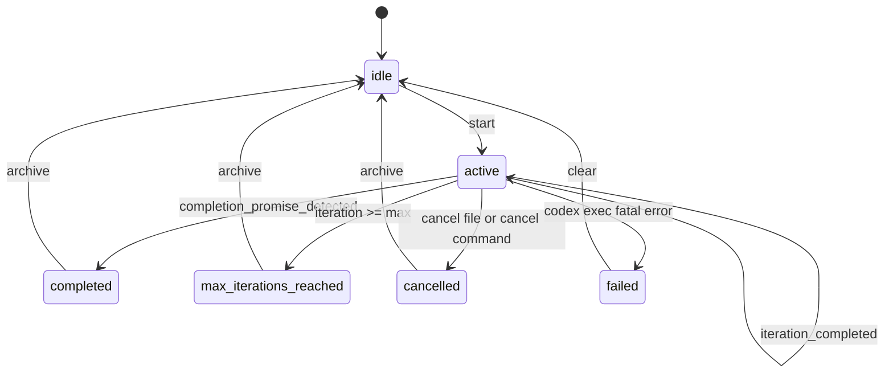
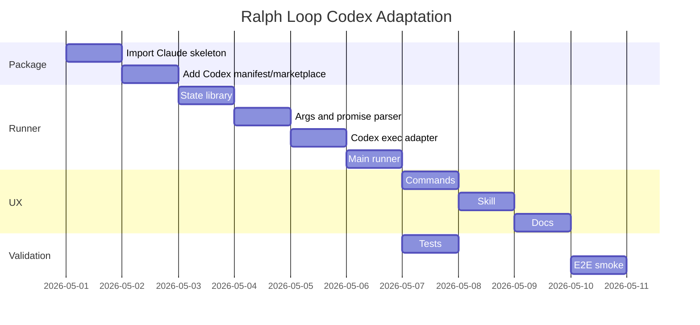

# Ralph Loop Codex Adaptation Implementation Plan

> **For agentic workers:** REQUIRED SUB-SKILL: Use `superpowers:subagent-driven-development` (recommended) or `superpowers:executing-plans` to implement this plan task-by-task. Steps use checkbox (`- [ ]`) syntax for tracking.

**Goal:** Adapt the official Claude Code `ralph-loop` plugin to work reliably in Codex CLI and Codex App while keeping the Claude Code path functional and isolated.

**Architecture:** Ship one dual-runtime plugin package with `.claude-plugin/` preserved for Claude Code and `.codex-plugin/` added for Codex. Codex will not depend on Claude's `Stop` hook because `codex plugin_hooks` is not stable in local Codex CLI `0.128.0`; Codex uses an explicit loop runner around `codex exec` with structured local state, atomic writes, cancellation, status, and doctor checks.

**Tech Stack:** Codex plugin manifest, Codex skills, Codex commands, Node.js 20+ scripts using only built-in modules, Bash wrapper, JSON state, JSONL event log, Markdown prompt/summary files, Claude Code hook compatibility files.

---

## Source Context

Primary sources checked:

- Official Awesome Claude Ralph page: `https://awesomeclaude.ai/ralph-wiggum`
- Official Claude plugin repository path: `https://github.com/anthropics/claude-plugins-official/tree/main/plugins/ralph-loop`
- Local Codex CLI: `codex-cli 0.128.0`
- Local Codex feature flags: `plugins=true`, `codex_hooks=true`, `plugin_hooks=false` under development
- Local Codex plugin examples: `vercel`, `build-macos-apps`, `superpowers`
- Local Codex plugin spec: `/Users/andersonlimadev/.codex/skills/.system/plugin-creator/references/plugin-json-spec.md`

Key upstream behavior:

- Claude command starts a Ralph loop.
- Claude `Stop` hook blocks session exit while `.claude/ralph-loop.local.md` exists.
- Hook parses current iteration, max iterations, completion promise, transcript path, last assistant text, then feeds the same prompt back.
- Completion is detected through `<promise>TEXT</promise>`.

Codex compatibility constraint:

- Codex plugin commands are prompt/workflow definitions, not Claude's executable slash-command blocks.
- Codex CLI supports `codex exec`, `codex exec resume`, `--output-last-message`, `--json`, `--cd`, `--sandbox`, `--ask-for-approval`, and model/config overrides.
- Current Codex plugin hooks cannot be the primary implementation because `plugin_hooks` is disabled/under development in the inspected CLI.

## Current Repository Findings

Repository today:

- Root project is an awesome-list style repo with `README.md`, `package.json`, `package-lock.json`, `pnpm-lock.yaml`, and `claude-vscode-theme/`.
- No `plugins/` directory exists yet.
- No `.agents/plugins/marketplace.json` exists yet.
- No Ralph plugin files exist locally.
- Branch is `feature/awsome-codex-plugins`.
- Working tree was clean before this plan except this new docs file.

Issues to avoid or fix in the Codex adaptation:

- Do not modify Claude behavior in the same PR unless needed for shared packaging; Claude fixes should be separate PRs.
- Do not add dependencies if Node built-ins can cover the runner.
- Avoid adding another lockfile or package manager decision; use Node built-in `node:test`.
- Add repo-local marketplace metadata so Codex can discover the plugin.
- Keep generated loop state out of git by writing state under `.codex/ralph-loop/` with a generated `.gitignore`.

Issues observed in upstream Claude implementation that Codex adaptation must correct:

- Markdown frontmatter parsed with `grep`/`sed` is fragile for quoted values, newlines, and malformed files.
- No lock prevents two loops in the same workspace from racing.
- State file creation is not fully atomic.
- Default unlimited loop is dangerous; Codex adaptation requires an explicit `--unlimited` or bounded default.
- Transcript JSONL parsing assumes Claude internals and requires `jq`/`perl`.
- The user-facing warning says no manual stop, while a cancel command exists.
- Windows support is a documented workaround, not a first-class path.
- Shell argument handling risks accidental injection if prompts/options are not passed as arrays.

## Non-Goals

- Do not reimplement Claude Code itself.
- Do not depend on unstable Codex plugin hooks for the primary Codex loop.
- Do not require SQLite, Python packages, jq, perl, npm install, or global Node packages.
- Do not change `claude-vscode-theme/`.
- Do not rewrite the root awesome list in this PR.
- Do not run unbounded loops by default.

## Runtime Architecture



## Codex Loop Sequence



## State Machine



## Persistence Decision

| Option | Pros | Cons | Decision |
|---|---|---|---|
| Markdown state only | Human-readable, matches Claude path | Fragile parsing, hard locking, bad for machines | Use only for prompt/summary, not authoritative state |
| Single JSON state | Structured, no deps, easy validation, human-readable | Needs atomic writes and lock discipline | Use as authoritative state |
| JSONL event log | Append-only audit, easy tail/diagnostics | Needs compaction for long runs | Use for event history |
| SQLite | Transactions, concurrency, query power | Extra binary/runtime assumptions, overkill for one active loop, conflicts with zero-dep goal | Do not use by default |
| Plain text shell vars | Simple | Unsafe parsing, injection risk, poor validation | Reject |

Chosen persistence model:

- `.codex/ralph-loop/state.json`: authoritative current loop.
- `.codex/ralph-loop/events.jsonl`: append-only audit trail.
- `.codex/ralph-loop/prompt.md`: original user prompt, stored once.
- `.codex/ralph-loop/summary.md`: compact progress summary for next iteration.
- `.codex/ralph-loop/last-message.md`: last assistant final message from `codex exec -o`.
- `.codex/ralph-loop/cancel`: cancellation sentinel.
- `.codex/ralph-loop/lock`: atomic lock directory.
- `.codex/ralph-loop/.gitignore`: contains `*` so state does not get committed.

State schema:

```json
{
  "schemaVersion": 1,
  "runtime": "codex",
  "loopId": "2026-05-01T12-00-00Z-ralph-6f7a2b",
  "workspace": "/absolute/workspace/path",
  "status": "active",
  "mode": "fresh",
  "iteration": 1,
  "maxIterations": 10,
  "completionPromise": "DONE",
  "startedAt": "2026-05-01T12:00:00.000Z",
  "updatedAt": "2026-05-01T12:03:00.000Z",
  "model": null,
  "reasoning": null,
  "sandbox": "workspace-write",
  "approvalPolicy": "never",
  "lastExitCode": 0,
  "lastMessagePath": ".codex/ralph-loop/last-message.md",
  "promptPath": ".codex/ralph-loop/prompt.md",
  "summaryPath": ".codex/ralph-loop/summary.md"
}
```

Event schema:

```json
{"ts":"2026-05-01T12:00:00.000Z","loopId":"...","type":"started","iteration":1}
{"ts":"2026-05-01T12:02:30.000Z","loopId":"...","type":"iteration_completed","iteration":1,"exitCode":0,"promiseDetected":false}
{"ts":"2026-05-01T12:05:10.000Z","loopId":"...","type":"completed","iteration":3,"promise":"DONE"}
```

## Token Strategy

Default Codex mode is `fresh`, not transcript-resume:

- Each iteration starts a new `codex exec` process.
- Files, git diff, test output files, and summary persist across iterations.
- The next prompt is compact and instructs Codex to read `prompt.md` and `summary.md`.
- The runner does not paste full previous transcript into the next prompt.
- `--output-last-message` captures only the final assistant message for promise detection.
- `events.jsonl` stores machine audit, not model-visible context.
- `summary.md` is capped at a small deterministic budget.

Prompt sent to Codex on iteration N:

```text
You are running Ralph Loop for Codex.

Workspace: <workspace>
Iteration: <N> of <max-or-unlimited>
Original task: read .codex/ralph-loop/prompt.md
Progress summary: read .codex/ralph-loop/summary.md if present

Continue the same task. Inspect the repo state, run relevant verification, fix failures, and update files.
If and only if the completion promise is completely true, end your final answer with:
<promise>DONE</promise>

Do not output the promise to escape the loop. If blocked, document the blocker in the workspace and continue until max iterations.
```

Optional advanced mode after implementation is stable:

- `--mode resume` may call `codex exec resume` only after a dedicated test proves stable session-id extraction for the local Codex version.
- Until then, `fresh` is the supported default because it is safer and lower-token.

## File Structure

Create:

- `.agents/plugins/marketplace.json`: repo-local Codex marketplace.
- `plugins/ralph-loop/.codex-plugin/plugin.json`: Codex plugin manifest.
- `plugins/ralph-loop/.claude-plugin/plugin.json`: copied or preserved Claude manifest when importing official plugin.
- `plugins/ralph-loop/README.md`: dual-runtime user docs.
- `plugins/ralph-loop/LICENSE`: keep Apache-2.0 if copying official plugin files.
- `plugins/ralph-loop/NOTICE`: attribution to Anthropic official plugin and Codex adaptation.
- `plugins/ralph-loop/commands/ralph-loop.md`: start command.
- `plugins/ralph-loop/commands/cancel-ralph.md`: cancel command.
- `plugins/ralph-loop/commands/ralph-status.md`: status command.
- `plugins/ralph-loop/commands/ralph-doctor.md`: environment validation command.
- `plugins/ralph-loop/hooks/hooks.json`: Claude hook config preserved.
- `plugins/ralph-loop/hooks/stop-hook.sh`: Claude hook preserved initially.
- `plugins/ralph-loop/scripts/setup-ralph-loop.sh`: Claude setup script preserved initially.
- `plugins/ralph-loop/scripts/ralph-codex.sh`: Bash wrapper for Codex.
- `plugins/ralph-loop/scripts/ralph-codex.mjs`: Codex runner CLI.
- `plugins/ralph-loop/scripts/lib/args.mjs`: argument parser.
- `plugins/ralph-loop/scripts/lib/state.mjs`: JSON state, lock, atomic writes.
- `plugins/ralph-loop/scripts/lib/promise.mjs`: `<promise>` extraction.
- `plugins/ralph-loop/scripts/lib/codex-exec.mjs`: spawn `codex exec`.
- `plugins/ralph-loop/scripts/lib/summary.mjs`: compact summary writer.
- `plugins/ralph-loop/scripts/lib/doctor.mjs`: environment checks.
- `plugins/ralph-loop/skills/ralph-loop/SKILL.md`: Codex-native skill.
- `plugins/ralph-loop/skills/ralph-loop/agents/openai.yaml`: UI metadata.
- `plugins/ralph-loop/skills/ralph-loop/references/prompt-patterns.md`: prompt templates and best practices.
- `plugins/ralph-loop/test/args.test.mjs`: parser tests.
- `plugins/ralph-loop/test/state.test.mjs`: persistence tests.
- `plugins/ralph-loop/test/promise.test.mjs`: completion detection tests.
- `plugins/ralph-loop/test/runner.test.mjs`: fake `codex exec` integration tests.
- `plugins/ralph-loop/test/fixtures/fake-codex.mjs`: deterministic fake Codex binary.

Modify:

- `package.json`: add `test:ralph` script using Node built-in test runner.
- `README.md`: add a compact "Codex Plugins" section only if required for discoverability.

Do not modify:

- `claude-vscode-theme/**`
- Existing assets unless plugin logo reuse is explicitly chosen.

## Codex Plugin Manifest

Target file: `plugins/ralph-loop/.codex-plugin/plugin.json`

```json
{
  "name": "ralph-loop",
  "version": "1.0.0-codex.1",
  "description": "Persistent iterative AI development loops for Codex CLI and Codex App, adapted from the Ralph Wiggum technique.",
  "author": {
    "name": "Anthropic + Awesome Codex adaptation",
    "url": "https://github.com/Andersonlimahw/awesome-codex"
  },
  "homepage": "https://awesomeclaude.ai/ralph-wiggum",
  "repository": "https://github.com/Andersonlimahw/awesome-codex",
  "license": "Apache-2.0",
  "keywords": ["codex", "claude-code", "ralph-loop", "automation", "agents", "iteration"],
  "skills": "./skills/",
  "interface": {
    "displayName": "Ralph Loop",
    "shortDescription": "Run bounded self-improving Codex loops with persistent local state",
    "longDescription": "Ralph Loop adds iterative AI development loops to Codex CLI and Codex App. It stores prompts, state, summaries, and events locally, runs bounded codex exec iterations, detects completion promises, and keeps Claude Code compatibility files intact.",
    "developerName": "Awesome Codex",
    "category": "Coding",
    "capabilities": ["Interactive", "Read", "Write"],
    "websiteURL": "https://awesomeclaude.ai/ralph-wiggum",
    "privacyPolicyURL": "https://openai.com/policies/row-privacy-policy/",
    "termsOfServiceURL": "https://openai.com/policies/row-terms-of-use/",
    "defaultPrompt": [
      "Start a Ralph loop for this task",
      "Show Ralph loop status",
      "Cancel the active Ralph loop"
    ],
    "brandColor": "#0EA5E9",
    "screenshots": []
  }
}
```

## Marketplace Entry

Target file: `.agents/plugins/marketplace.json`

```json
{
  "name": "awesome-codex",
  "interface": {
    "displayName": "Awesome Codex"
  },
  "plugins": [
    {
      "name": "ralph-loop",
      "source": {
        "source": "local",
        "path": "./plugins/ralph-loop"
      },
      "policy": {
        "installation": "AVAILABLE",
        "authentication": "ON_INSTALL"
      },
      "category": "Coding"
    }
  ]
}
```

## Command Design

### `/ralph-loop:ralph-loop`

Purpose: start a Codex Ralph loop from Codex CLI/App and preserve Claude command behavior.

Codex command body must instruct the agent to resolve the runner in this order:

1. `./plugins/ralph-loop/scripts/ralph-codex.mjs` for repo-local development.
2. `~/.codex/plugins/cache/**/ralph-loop/**/scripts/ralph-codex.mjs` for installed plugin cache.
3. `~/.local/bin/ralph-loop-codex` if user installed the wrapper.

Command execution snippet:

```bash
RALPH_RUNNER="$(
  find ./plugins "$HOME/.codex/plugins/cache" -path '*/ralph-loop*/scripts/ralph-codex.mjs' -type f -print 2>/dev/null | head -1
)"
if [ -z "$RALPH_RUNNER" ] && command -v ralph-loop-codex >/dev/null 2>&1; then
  ralph-loop-codex start $ARGUMENTS
elif [ -n "$RALPH_RUNNER" ]; then
  node "$RALPH_RUNNER" start $ARGUMENTS
else
  echo "Ralph Loop runner not found. Run /ralph-loop:ralph-doctor for installation diagnostics." >&2
  exit 1
fi
```

Implementation note:

- The runner must parse options safely after receiving them from the shell.
- Later hardening can replace `$ARGUMENTS` with a command file contract if Codex exposes structured slash-command args.

### `/ralph-loop:cancel-ralph`

Purpose: cancel an active Codex loop or the Claude loop in the current workspace.

Behavior:

- If `.codex/ralph-loop/state.json` exists and status is `active`, write `.codex/ralph-loop/cancel`.
- If `.claude/ralph-loop.local.md` exists, remove it only after reporting that this cancels Claude's loop.
- Report current iteration from the matching state file.

### `/ralph-loop:ralph-status`

Purpose: read-only status summary.

Behavior:

- Print Codex state fields.
- Tail last 10 JSONL events in human-readable form.
- Report Claude state if `.claude/ralph-loop.local.md` exists.

### `/ralph-loop:ralph-doctor`

Purpose: validate install and runtime.

Checks:

- `codex --version`
- Node major version >= 20
- plugin runner path found
- workspace is writable
- `.codex/ralph-loop/` can be created
- no stale lock exists
- current Codex `plugin_hooks` state is reported as advisory only

## Runner CLI Contract

Executable:

```bash
node plugins/ralph-loop/scripts/ralph-codex.mjs <command> [options] -- <prompt>
```

Commands:

- `start`: create state and run loop.
- `status`: show state and events.
- `cancel`: write cancel sentinel.
- `doctor`: validate environment.
- `clear`: archive inactive state after completion/cancel/failure.

Options:

```text
--workspace <path>             default: process.cwd()
--max-iterations <n>           default: 10
--unlimited                    maps maxIterations to 0
--completion-promise <text>    optional exact promise text
--mode <fresh|resume>          default: fresh
--model <model>                optional, passed to codex exec -m
--reasoning <level>            optional, passed as -c model_reasoning_effort="<level>"
--sandbox <mode>               default: workspace-write
--approval <policy>            default: never
--iteration-timeout-sec <n>    default: 1800
--summary-max-chars <n>        default: 6000
--ephemeral                    pass --ephemeral to codex exec
```

Default safety:

- Max iterations default to `10`.
- Unlimited requires `--unlimited`.
- Sandbox defaults to `workspace-write`.
- Approval defaults to `never` to prevent unattended loop stalls.
- `danger-full-access` is allowed only if user passes it explicitly.

## Core Runner Algorithm

```js
async function startLoop(options) {
  const workspace = resolveWorkspace(options.workspace)
  const paths = resolveStatePaths(workspace)
  await acquireLock(paths.lockDir)
  try {
    const state = await createInitialState(paths, options)
    await writePrompt(paths.prompt, options.prompt)
    await appendEvent(paths.events, { type: "started", iteration: 1 })

    while (true) {
      const current = await readState(paths.state)
      if (await cancelRequested(paths.cancel)) return await finish(paths, current, "cancelled")
      if (current.maxIterations > 0 && current.iteration > current.maxIterations) {
        return await finish(paths, current, "max_iterations_reached")
      }

      const prompt = await renderIterationPrompt(paths, current)
      const result = await runCodexExec({ workspace, prompt, state: current, paths })
      const lastMessage = await readText(paths.lastMessage)
      const promise = extractPromise(lastMessage)
      const promiseDetected = current.completionPromise && promise === current.completionPromise

      await appendEvent(paths.events, {
        type: "iteration_completed",
        iteration: current.iteration,
        exitCode: result.exitCode,
        promiseDetected
      })

      if (result.exitCode !== 0) return await finish(paths, current, "failed")
      if (promiseDetected) return await finish(paths, current, "completed")

      await updateSummary(paths, current, lastMessage)
      await writeStateAtomic(paths.state, {
        ...current,
        iteration: current.iteration + 1,
        updatedAt: new Date().toISOString(),
        lastExitCode: result.exitCode
      })
    }
  } finally {
    await releaseLock(paths.lockDir)
  }
}
```

## Security Design

- Use `spawn()` with argument arrays, not `exec()` with interpolated strings.
- Write prompts to files and pass iteration prompt through stdin.
- Reject `--max-iterations` values that are negative, decimal, or non-numeric.
- Reject completion promises containing `\0`.
- Normalize completion promise whitespace only inside `<promise>` content.
- Use atomic write: write temp file, `fsync`, rename.
- Use atomic lock directory: `mkdir .codex/ralph-loop/lock`.
- Refuse to start if an active lock exists unless `--clear-stale-lock` is passed and no PID is alive.
- Do not print env vars.
- Do not use `--dangerously-bypass-approvals-and-sandbox`.
- Preserve user config unless explicit CLI options override model/sandbox/approval.

## Implementation Tasks

### Task 1: Import And Package Ralph Plugin Skeleton

**Files:**

- Create: `plugins/ralph-loop/.claude-plugin/plugin.json`
- Create: `plugins/ralph-loop/hooks/hooks.json`
- Create: `plugins/ralph-loop/hooks/stop-hook.sh`
- Create: `plugins/ralph-loop/scripts/setup-ralph-loop.sh`
- Create: `plugins/ralph-loop/LICENSE`
- Create: `plugins/ralph-loop/NOTICE`
- Create: `plugins/ralph-loop/README.md`

- [ ] Copy official Claude plugin files into `plugins/ralph-loop/` with original license.
- [ ] Preserve original Claude script behavior in this task.
- [ ] Add `NOTICE` with upstream repository URL and local adaptation note.
- [ ] Run `bash -n plugins/ralph-loop/hooks/stop-hook.sh`.
- [ ] Run `bash -n plugins/ralph-loop/scripts/setup-ralph-loop.sh`.
- [ ] Commit: `chore: import ralph loop plugin skeleton`

### Task 2: Add Codex Marketplace And Manifest

**Files:**

- Create: `.agents/plugins/marketplace.json`
- Create: `plugins/ralph-loop/.codex-plugin/plugin.json`

- [ ] Add marketplace JSON exactly as shown in this plan.
- [ ] Add Codex manifest exactly as shown in this plan.
- [ ] Validate JSON:

```bash
jq . .agents/plugins/marketplace.json
jq . plugins/ralph-loop/.codex-plugin/plugin.json
```

- [ ] Test local marketplace registration:

```bash
codex plugin marketplace add /Users/andersonlimadev/Projects/IA/awesome-codex
```

- [ ] Commit: `feat: add codex marketplace metadata for ralph loop`

### Task 3: Implement Codex State Library

**Files:**

- Create: `plugins/ralph-loop/scripts/lib/state.mjs`
- Create: `plugins/ralph-loop/test/state.test.mjs`

State library API:

```js
export function resolveStatePaths(workspace) {}
export async function ensureStateDir(paths) {}
export async function acquireLock(lockDir) {}
export async function releaseLock(lockDir) {}
export async function readState(statePath) {}
export async function writeStateAtomic(statePath, state) {}
export async function appendEvent(eventsPath, event) {}
export async function requestCancel(cancelPath) {}
export async function isCancelRequested(cancelPath) {}
```

Test cases:

- creates `.codex/ralph-loop/.gitignore` with `*`
- writes valid JSON atomically
- appends JSONL events
- prevents second lock acquisition
- releases lock after failure
- reads missing state as `null`

Run:

```bash
node --test plugins/ralph-loop/test/state.test.mjs
```

Commit: `feat: add ralph codex state store`

### Task 4: Implement Args And Promise Parsing

**Files:**

- Create: `plugins/ralph-loop/scripts/lib/args.mjs`
- Create: `plugins/ralph-loop/scripts/lib/promise.mjs`
- Create: `plugins/ralph-loop/test/args.test.mjs`
- Create: `plugins/ralph-loop/test/promise.test.mjs`

Parser behavior:

- Supports options before and after prompt.
- Supports `--` prompt separator.
- Defaults `maxIterations` to `10`.
- Maps `--unlimited` to `maxIterations: 0`.
- Rejects invalid numeric values.
- Keeps prompt text exact after shell parsing.

Promise behavior:

- Finds first `<promise>...</promise>` block.
- Supports multiline content.
- Collapses inner whitespace.
- Compares literally after normalization.
- Does not treat plain `DONE` as completion.

Run:

```bash
node --test plugins/ralph-loop/test/args.test.mjs plugins/ralph-loop/test/promise.test.mjs
```

Commit: `feat: parse ralph codex options and promise output`

### Task 5: Implement Codex Exec Adapter

**Files:**

- Create: `plugins/ralph-loop/scripts/lib/codex-exec.mjs`
- Create: `plugins/ralph-loop/test/fixtures/fake-codex.mjs`
- Create: `plugins/ralph-loop/test/runner.test.mjs`

Adapter behavior:

- Uses `spawn(codexBin, args, { cwd: workspace })`.
- Default `codexBin` is `codex`.
- Test override via `RALPH_CODEX_BIN`.
- Passes prompt through stdin with `codex exec -`.
- Writes final message through `-o .codex/ralph-loop/last-message.md`.
- Passes `--cd`, `--sandbox`, `--ask-for-approval`, optional `--model`, optional `-c model_reasoning_effort="<level>"`.
- Supports timeout and kills child process on timeout.

Run:

```bash
node --test plugins/ralph-loop/test/runner.test.mjs
```

Commit: `feat: run codex exec from ralph loop`

### Task 6: Implement Main Runner And Wrapper

**Files:**

- Create: `plugins/ralph-loop/scripts/ralph-codex.mjs`
- Create: `plugins/ralph-loop/scripts/ralph-codex.sh`
- Create: `plugins/ralph-loop/scripts/lib/summary.mjs`
- Create: `plugins/ralph-loop/scripts/lib/doctor.mjs`

Runner commands:

- `start`
- `status`
- `cancel`
- `doctor`
- `clear`

Wrapper:

```bash
#!/usr/bin/env bash
set -euo pipefail
SCRIPT_DIR="$(cd "$(dirname "${BASH_SOURCE[0]}")" && pwd)"
exec node "$SCRIPT_DIR/ralph-codex.mjs" "$@"
```

Run:

```bash
bash -n plugins/ralph-loop/scripts/ralph-codex.sh
node plugins/ralph-loop/scripts/ralph-codex.mjs doctor
```

Commit: `feat: add ralph codex runner`

### Task 7: Add Codex Commands

**Files:**

- Create or update: `plugins/ralph-loop/commands/ralph-loop.md`
- Create or update: `plugins/ralph-loop/commands/cancel-ralph.md`
- Create: `plugins/ralph-loop/commands/ralph-status.md`
- Create: `plugins/ralph-loop/commands/ralph-doctor.md`

Command requirements:

- Use Codex command style: concise frontmatter with `description`.
- Include resolver logic for local repo, plugin cache, and wrapper binary.
- Keep Claude executable command behavior only where Claude supports it.
- Do not require users to know plugin cache paths.

Run a command syntax review by opening each markdown file and verifying no unresolved placeholder remains:

```bash
grep -R -E 'TO''DO|TB''D|PLACE''HOLDER' plugins/ralph-loop/commands && exit 1 || true
```

Commit: `feat: add ralph loop codex commands`

### Task 8: Add Codex Skill

**Files:**

- Create: `plugins/ralph-loop/skills/ralph-loop/SKILL.md`
- Create: `plugins/ralph-loop/skills/ralph-loop/agents/openai.yaml`
- Create: `plugins/ralph-loop/skills/ralph-loop/references/prompt-patterns.md`

Skill frontmatter:

```yaml
---
name: ralph-loop
description: Use when the user wants Codex to run an iterative self-improving development loop, automate repeated codex exec attempts, continue until tests pass, use a completion promise, cancel or inspect a Ralph loop, or adapt the Ralph Wiggum technique for Codex CLI or Codex App.
---
```

Skill body must cover:

- When to use Ralph.
- When not to use Ralph.
- Required safety: bounded iterations unless user explicitly chooses unlimited.
- Good prompt pattern with `<promise>`.
- Commands and runner contract.
- Troubleshooting with `ralph-doctor`.
- Token-cost warning and `--model` / `--reasoning` controls.

Generate or manually validate `agents/openai.yaml` against SKILL.md.

Commit: `feat: add codex ralph loop skill`

### Task 9: Add Tests And Root Test Script

**Files:**

- Modify: `package.json`
- Create: `plugins/ralph-loop/test/*.test.mjs`

Root script:

```json
{
  "scripts": {
    "test:ralph": "node --test plugins/ralph-loop/test/*.test.mjs"
  }
}
```

Keep existing scripts intact.

Run:

```bash
npm run test:ralph
npm test
```

Commit: `test: cover ralph codex runner`

### Task 10: Add Documentation

**Files:**

- Modify: `plugins/ralph-loop/README.md`
- Optionally modify: `README.md`

README must include:

- Claude Code install and usage.
- Codex CLI install and usage.
- Codex App install and usage.
- State file locations.
- Cancellation/status/doctor commands.
- Persistence explanation.
- Token strategy.
- Safety defaults.
- Troubleshooting.

Codex CLI install:

```bash
codex plugin marketplace add /Users/andersonlimadev/Projects/IA/awesome-codex
```

If manual enable is needed:

```toml
[plugins."ralph-loop@awesome-codex"]
enabled = true
```

Codex CLI use:

```text
/ralph-loop:ralph-loop "Run tests, fix failures, and update docs. Output <promise>DONE</promise> only when all tests pass." --completion-promise DONE --max-iterations 10
```

Codex App use:

```bash
codex app /path/to/workspace
```

Then in app composer:

```text
/ralph-loop:ralph-loop "Implement the narrow task and verify it. Output <promise>DONE</promise> only when done." --completion-promise DONE --max-iterations 5
```

Direct runner use:

```bash
node /path/to/awesome-codex/plugins/ralph-loop/scripts/ralph-codex.mjs start --workspace /path/to/project --completion-promise DONE --max-iterations 5 -- "Fix failing tests. Output <promise>DONE</promise> only when green."
```

Commit: `docs: document ralph loop codex usage`

### Task 11: Validate End To End

**Files:**

- No new files unless test fixtures reveal missing coverage.

Validation commands:

```bash
jq . .agents/plugins/marketplace.json
jq . plugins/ralph-loop/.codex-plugin/plugin.json
bash -n plugins/ralph-loop/scripts/*.sh
node --test plugins/ralph-loop/test/*.test.mjs
npm run test:ralph
npm test
codex plugin marketplace add /Users/andersonlimadev/Projects/IA/awesome-codex
node plugins/ralph-loop/scripts/ralph-codex.mjs doctor
```

Live smoke in temp repo:

```bash
tmpdir="$(mktemp -d)"
cd "$tmpdir"
git init
printf 'test\n' > README.md
node /Users/andersonlimadev/Projects/IA/awesome-codex/plugins/ralph-loop/scripts/ralph-codex.mjs start --workspace "$tmpdir" --max-iterations 1 --completion-promise DONE -- "Read README.md and stop at max iteration without changing files."
```

Expected:

- State is created under `$tmpdir/.codex/ralph-loop/`.
- Loop exits at max iteration if no promise is emitted.
- Lock is removed.
- Status command reports `max_iterations_reached`.

Commit: `test: validate ralph loop codex e2e`

### Task 12: Prepare PR

**Files:**

- No new files.

PR checklist:

- [ ] Claude files preserved and shell syntax valid.
- [ ] Codex manifest valid.
- [ ] Marketplace valid.
- [ ] Runner tests pass.
- [ ] Root lint/test pass.
- [ ] README covers Codex CLI and Codex App.
- [ ] No generated `.codex/ralph-loop` state committed.
- [ ] No API keys, logs, or transcripts committed.
- [ ] PR description lists known Claude upstream issues as separate PR candidates.

Commit: `docs: finalize ralph loop codex adaptation plan`

## Separate Claude PR Candidates

Open separate PRs against Claude plugin or local Claude compatibility only after Codex PR lands:

- Replace fragile YAML parsing with safer parser or strict key-value format.
- Add lock file to avoid concurrent Claude sessions touching the same state.
- Make state writes atomic.
- Align "cannot be stopped manually" documentation with `cancel-ralph`.
- Add dependency checks for `jq`, `perl`, `bash`, and Windows Git Bash.
- Add tests for malformed state, completion promise with shell glob characters, and transcript format changes.

## Acceptance Criteria

Codex CLI:

- User can install the marketplace from this repo.
- User can enable `ralph-loop@awesome-codex`.
- User can run `/ralph-loop:ralph-loop ... --completion-promise DONE --max-iterations 3`.
- Loop runs `codex exec` repeatedly and stops on promise or max iterations.
- `status`, `cancel`, and `doctor` work.
- State remains local and uncommitted.

Codex App:

- User can open `codex app /workspace`.
- Plugin commands appear after plugin enablement.
- `/ralph-loop:ralph-loop` starts the same runner.
- Foreground run streams command output in the app.
- User can cancel with the app stop control or `/ralph-loop:cancel-ralph`.

Claude Code:

- Existing Claude command and `Stop` hook still work.
- `.claude/ralph-loop.local.md` remains Claude-only.
- Codex runner does not remove or mutate Claude state unless user invokes cancel and confirms mixed-runtime cancellation.

Quality:

- No runtime dependency beyond Node 20+, Bash wrapper, and Codex CLI.
- Tests use fake Codex binary by default.
- No actual model calls in unit tests.
- No unbounded loop unless user passes `--unlimited`.

## Implementation Order



## PR Strategy

One Codex adaptation PR:

- Adds plugin package and Codex runner.
- Preserves Claude compatibility.
- Includes tests and docs.
- Does not refactor unrelated repo content.

Separate Claude PRs:

- Upstream hook hardening.
- Claude docs contradiction fix.
- Windows/Git Bash improvements.

## Notes For Implementer

- Use `rtk` prefix for shell commands in this repo because `AGENTS.md` imports `/Users/andersonlimadev/.codex/RTK.md`.
- Use `apply_patch` for manual edits.
- Do not use destructive git commands.
- Keep generated test temp directories outside the repo or under ignored temp paths.
- Prefer small commits after each task.
